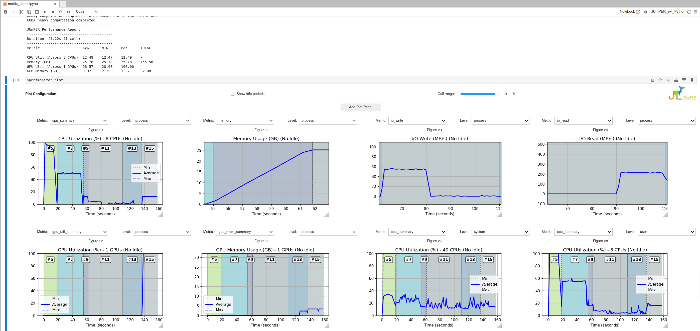

[](https://github.com/ScaDS/jumper_jupyter_performance/actions/workflows/test.yml)
[](https://github.com/ScaDS/jumper_jupyter_performance/actions/workflows/formatter.yml)
[](https://github.com/ScaDS/jumper_jupyter_performance/actions/workflows/linter.yml)
[](https://scads.github.io/jumper_jupyter_performance/latest/)
[](https://mybinder.org/v2/gh/ScaDS/jumper_jupyter_performance/feature/binder?urlpath=%2Fdoc%2Ftree%2Fdemos%2Fquick_start.ipynb)

<p align="center">

</p>

# JUmPER: Jupyter meets Performance

JUmPER brings performance engineering to Jupyter. This repository contains two packages:

- **JUmPER IPython Extension** (`jumper_extension/`) — Real-time performance monitoring in IPython environments and Jupyter notebooks. Gather performance data on CPU usage, memory consumption, GPU utilization, and I/O operations for individual cells and present it as text reports or interactive plots.

- **JUmPER Wrapper Kernel** (`jumper_wrapper_kernel/`) — A Jupyter kernel that wraps other kernels (Python, R, Julia, etc.) while providing jumper-extension performance monitoring. See the [Wrapper Kernel](#jumper-wrapper-kernel) section below.

Related project:

- [Score-P Jupyter kernel Python](https://github.com/score-p/scorep_jupyter_kernel_python) — Instrument, trace, or profile your Python code in Jupyter using [Score-P](https://score-p.org/). The Score-P kernel and the IPython extension can be seamlessly integrated.


# Table of Content

* [Installation](#installation)
* [Configuration](#configuration)
	+ [Environment Variables](#environment-variables)
* [Quick Start](#quick-start)
	+ [Load the Extension](#load-the-extension)
	+ [Basic Usage](#basic-usage)
* [Metrics Collection](#metrics-collection)
	+ [Performance Monitoring Levels](#performance-monitoring-levels)
	+ [Collected Metrics](#collected-metrics)
* [Available Commands](#available-commands)
* [Full Documentation](#full-documentation)
* [JUmPER Wrapper Kernel](#jumper-wrapper-kernel)
* [Contribution and Citing](#contribution-and-citing)

## Installation

```bash
pip install jumper_extension
```

or install it from source:

```bash
pip install .
```

**Optional GPU Support:**

For NVIDIA GPU monitoring:
```bash
pip install pynvml
```

For AMD GPU monitoring:
```bash
pip install ADLXPybind
```

Both GPU libraries can be installed simultaneously to monitor mixed GPU systems.

## Configuration

### Environment Variables

- **`JUMPER_LOG_DIR`**: Directory where JUmPER stores log files (info.log, debug.log, error.log)
  - Default: User's home directory
  - Example: `export JUMPER_LOG_DIR=/path/to/logs`

## Quick Start

Try it yourself:
[](https://mybinder.org/v2/gh/ScaDS/jumper_jupyter_performance/feature/binder?urlpath=%2Fdoc%2Ftree%2Fdemos%2Fquick_start.ipynb)

### Load the Extension

```python
%load_ext jumper_extension
```

### Basic Usage

1. **Start monitoring**:
   ```python
   %perfmonitor_start [interval]
   ```

   `interval` is an optional argument for configuring frequency of performance data gathering (in seconds), set to 1 by default. This command launches a performance monitoring daemon.

2. **Run your code**

3. **View performance report**:
   ```python
   %perfmonitor_perfreport
   %perfmonitor_perfreport --cell 2:5 --level user
   ```

   Will print aggregate performance report for entire notebook execution so far:

   ```
   ----------------------------------------
   Performance Report
   ----------------------------------------
   Duration: 11.08s
   Metric                    AVG      MIN      MAX      TOTAL   
   -----------------------------------------------------------------
   CPU Util (Across CPUs)    10.55    3.86     45.91    -       
   Memory (GB)               7.80     7.74     7.99     15.40   
   GPU Util (Across GPUs)    27.50    5.00     33.00    -       
   GPU Memory (GB)           0.25     0.23     0.32     4.00    
   ```

   Options:
   - `--cell RANGE`: Specify cell range (e.g., `5`, `2:8`, `:5`)
   - `--level LEVEL`: Choose monitoring level (`process`, `user`, `system`, `slurm`)

4. **Plot performance data**:
   ```python
   %perfmonitor_plot
   ```

   Opens an interactive plot with widgets to explore performance metrics over time, filter by cell ranges, and select different monitoring levels.



### Direct plotting mode and exports

You can also run `%perfmonitor_plot` in a direct (non-widget) mode and save or export results.

- **Plot specific metrics (no ipywidgets):**
  ```python
  %perfmonitor_plot --metrics cpu_summary,memory
  ```

- **Choose monitoring level and cell range:**
  ```python
  %perfmonitor_plot --metrics cpu_summary --level user --cell 2:5
  ```

- **Save the plot as JPEG:**
  ```python
  %perfmonitor_plot --metrics cpu_summary,memory --save-jpeg performance_analysis.jpg
  ```

- **Export plot data to a pickle file (to reload later with full interactivity):**
  ```python
  %perfmonitor_plot --metrics cpu_summary --level user --pickle analysis_data.pkl
  ```
  The command prints a small Python snippet showing how to load the pickle and display the plot in a separate session.

Notes:
- `--metrics` accepts a comma-separated list of metric keys (see [Available Metric Keys](#available-metric-keys) below).
- `--level` supports the same levels as reports: `process` (default), `user`, `system`, and `slurm` (if available).
- `--cell` supports formats like `5`, `2:8`, `:5`, `3:`. Negative indices are supported (e.g., `-3:-1`).

### Live plotting mode

The `--live` flag enables a continuously updating plot that shows a sliding window of recent performance data. Panels auto-update in the background without blocking cell execution.

- **Start live plotting with defaults** (2s update interval, 120s window, shows CPU and Memory):
  ```python
  %perfmonitor_plot --live
  ```

- **Custom update interval and window size:**
  ```python
  %perfmonitor_plot --live 1.0 60
  ```
  Updates every 1 second, showing the last 60 seconds of data.

- **Select specific metrics for live panels:**
  ```python
  %perfmonitor_plot --live --metrics cpu_summary,memory
  ```

- **Monitor I/O alongside CPU:**
  ```python
  %perfmonitor_plot --live --metrics cpu_summary,io_read,io_write
  ```

- **GPU monitoring (requires pynvml or ADLXPybind):**
  ```python
  %perfmonitor_plot --live --metrics gpu_util_summary,gpu_mem_summary
  ```

Notes:
- Without `--metrics`, live mode shows two default panels (typically CPU and Memory).
- With `--metrics`, one panel is created per metric key specified.
- Live updates stop automatically when the monitor stops or the kernel is interrupted.
- The `--live` flag accepts up to two optional float arguments: update interval (default 2.0s) and sliding window size (default 120s).

### Available Metric Keys

The following metric keys can be used with `--metrics` for both direct and live plotting:

| Metric Key | Description |
|------------|-------------|
| `cpu_summary` | CPU utilization summary (min/avg/max across CPUs) |
| `memory` | Memory usage in GB |
| `io_read` | I/O read throughput (MB/s) |
| `io_write` | I/O write throughput (MB/s) |
| `io_read_count` | I/O read operations per second |
| `io_write_count` | I/O write operations per second |
| `gpu_util_summary` | GPU utilization summary (min/avg/max across GPUs) |
| `gpu_band_summary` | GPU memory bandwidth summary (min/avg/max) |
| `gpu_mem_summary` | GPU memory usage summary (min/avg/max) |
| `gpu_util` | GPU utilization per GPU |
| `gpu_band` | GPU memory bandwidth per GPU |
| `gpu_mem` | GPU memory usage per GPU |

*GPU metric keys are only available when GPU monitoring libraries are installed.*

5. **View cell execution history**:
   ```python
   %cell_history
   ```

   Shows an interactive table of all executed cells with timestamps and durations.

6. **Stop monitoring**:
   ```python
   %perfmonitor_stop
   ```

7. **Export data for external analysis**:
   ```python
   %perfmonitor_export_perfdata my_performance.csv --level system
   %perfmonitor_export_cell_history my_cells.json
   ```
   Export performance measurements for entire notebook and cell execution history with timestamps, allowing you to project measurements onto specific cells.

### Monitoring Right in Your Code
Run the monitor around any code block and save its performance profile to CSV/JSON.

```python
from jumper_extension.core.service import build_perfmonitor_service

service = build_perfmonitor_service()
service.start_monitoring(1.0)

with service.monitored():
    your_foo()

service.export_perfdata(file="your_foo_perf.csv")
service.stop_monitoring()
```

## Metrics Collection

### Performance Monitoring Levels

The extension supports four different levels of metric collection, each providing different scopes of system monitoring:

- **Process**: Metrics for the current Python process only
- **User**: Metrics for all processes belonging to the current user
- **System**: System-wide metrics across all processes and users (if visible)
- **Slurm**: Metrics for processes within the current SLURM job

### Collected Metrics

| Metric | Description |
|--------|-------------|
| `cpu_util` | CPU utilization percentage |
| `memory` | Memory usage in GB |
| `io_read_count` | Total number of read I/O operations |
| `io_write_count` | Total number of write I/O operations |
| `io_read_mb` | Total data read in MB |
| `gpu_util` | GPU compute utilization percentage across GPUs |
| `gpu_band` | GPU memory bandwidth utilization percentage |
| `gpu_mem` | GPU memory usage in GB across GPUs |
| `io_write_mb` | Total data written in MB |

*Note: GPU metrics support both NVIDIA GPUs (via pynvml library) and AMD GPUs (via ADLXPybind library). Both GPU types can be monitored simultaneously. Memory limits are automatically detected from SLURM cgroups when available.*

**GPU Support Details:**
- **NVIDIA GPUs**: Full support for all monitoring levels (process, user, system, slurm) including per-process GPU memory tracking
- **AMD GPUs**: System-level monitoring supported; per-process and per-user metrics are limited by AMD ADLX API capabilities


## Full Documentation

- Online (latest): https://scads.github.io/jumper_jupyter_performance/latest/
- Local sources: `docs/` (serve locally with `mkdocs serve`)


## Available Commands

| Command | Description |
|---------|-------------|
| `%perfmonitor_fast_setup` | Fast setup of JUmPER. Starts monitor (1.0s interval), enables perfreports (--level process) and interactive plots (ipympl) |
| `%perfmonitor_help` | Show all available commands with examples |
| `%perfmonitor_resources` | Display available hardware resources |
| `%perfmonitor_start [interval]` | Start monitoring (default: 1 second interval) |
| `%perfmonitor_stop` | Stop monitoring |
| `%perfmonitor_perfreport [--cell RANGE] [--level LEVEL]` | Show performance report for specific cell range and monitoring level |
| `%perfmonitor_plot [--metrics LIST] [--cell RANGE] [--level LEVEL] [--save-jpeg FILE] [--pickle FILE] [--live [INTERVAL WINDOW]]` | Interactive plot with widgets; direct plotting of selected metrics; live updating plots; optional export to JPEG or pickle |
| `%cell_history` | Show execution history of all cells with interactive table |
| `%perfmonitor_enable_perfreports` | Auto-generate reports after each cell |
| `%perfmonitor_disable_perfreports` | Disable auto-reports |
| `%perfmonitor_export_perfdata [--file filename] [--level LEVEL]` | Export performance data to dataframe. Export performance data to CSV if `--file` is set. |
| `%perfmonitor_export_cell_history [filename]` | Export cell history to CSV/JSON |

## JUmPER Wrapper Kernel

The Jumper Wrapper Kernel is a Jupyter kernel that wraps other kernels while providing jumper-extension performance monitoring capabilities.

### Installation

```bash
# Install the wrapper kernel (also installs jumper-extension as a dependency)
pip install jumper_wrapper_kernel

# Install the kernel spec
python -m jumper_wrapper_kernel.install install
```

Or install from source:

```bash
pip install ./jumper_wrapper_kernel
python -m jumper_wrapper_kernel.install install
```

### Usage

1. Start Jupyter Notebook or JupyterLab
2. Select **Jumper Wrapper Kernel** as your kernel
3. Use the magic commands:

```python
# List available kernels
%list_kernels

# Wrap a kernel (e.g. Python, R, Julia)
%wrap_kernel python3

# Start performance monitoring (handled locally)
%perfmonitor_start

# Run code on the wrapped kernel
import numpy as np
x = np.random.rand(1000, 1000)
y = np.dot(x, x.T)

# View performance report (handled locally)
%perfmonitor_perfreport
```

### Wrapper Kernel Demos

- **How to Wrap a Kernel: Basic R Kernel Example**\
[](https://mybinder.org/v2/gh/ScaDS/jumper_jupyter_performance/main?urlpath=%2Fdoc%2Ftree%2Fdemos%2Fnew_R_wrapping.ipynb)

- **H2O-Wrapped Tutorial**\
[](https://mybinder.org/v2/gh/ScaDS/jumper_jupyter_performance/main?urlpath=%2Fdoc%2Ftree%2Fdemos%2Fh2o-wrapper-tutorial.ipynb)

For full wrapper kernel documentation, see the [Wrapper Kernel docs](https://scads.github.io/jumper_jupyter_performance/latest/wrapper-kernel/).


## Contribution and Citing:
PRs are welcome. Feel free to use the pre-commit hooks provided in .githooks

If you publish some work using the kernel, we would appreciate if you cite one of the following papers:

```
Werner, E., Rygin, A., Gocht-Zech, A., Döbel, S., & Lieber, M. (2024, November).
JUmPER: Performance Data Monitoring, Instrumentation and Visualization for Jupyter Notebooks.
In SC24-W: Workshops of the International Conference for High Performance Computing, Networking, Storage and Analysis (pp. 2003-2011). IEEE.
https://www.doi.org/10.1109/SCW63240.2024.00250
```
