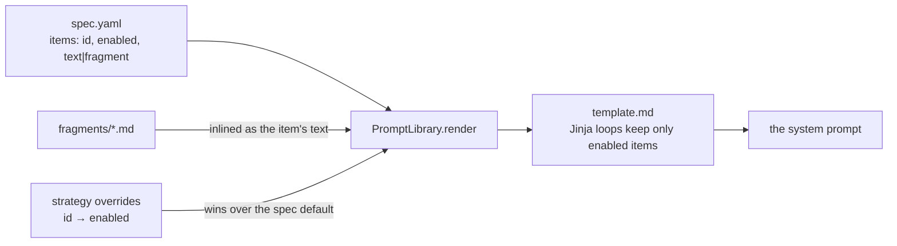
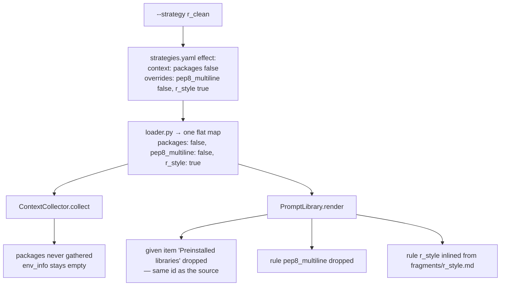

# Steering the Review

A review is steered with two arguments: `--strategy` picks a prepared angle,
`--note` says anything the prepared ones do not cover.

```python
%perfmonitor_ai_review --strategy parallelization
%perfmonitor_ai_review --strategy custom --note "keep it single-threaded, we run under SLURM"
```

## What a strategy changes

Each strategy pulls two levers at once:

- **Context sources** — what the model is given (cell code, timings, metric
  summaries, tags, hardware, installed packages, raw metric arrays).
- **Prompt items** — individual lines of the system prompts, switched on or off
  one by one.

The two stay in step: a source that is turned off is neither collected nor
mentioned in the prompt, so the model is never told about data it did not get.

## Available strategies

| `--strategy` | Use it when | What it turns on |
|---|---|---|
| `faster` *(default)* | You just want the cell to be quicker. | The standard context; the model picks the angle. |
| `parallelization` | A GPU sits idle, or cores do. | GPU-offload rules, a hint to look for under-used parallel hardware, and the installed-package list. |
| `deep` | The summaries hide the shape of the problem — bursts, stalls, a slow start. | The **raw per-timestep metric arrays** behind `%perfmonitor_plot`, plus packages. |
| `custom` | None of the above describes the goal. | Nothing on its own — **requires `--note`**. |
| `r_clean` | Reviewing R cells. | The R style rule instead of the Python/PEP 8 one; drops the package list. |

The default comes from `ai.context.strategy` in
[configuration](../configuration.md#aicontext-what-the-model-is-told).

!!! tip
    `deep` sends every sample of every metric for the reviewed range. It is the
    most expensive strategy by a wide margin — use it on one cell, not a range.

## `--note`

Free text, folded into the prompt. Its meaning depends on where it is used:

| Command | Effect of `--note` |
|---|---|
| `%perfmonitor_ai_review --note "..."` | Steers which suggestions are generated. |
| `%perfmonitor_ai_review --resume ID --select N --note "..."` | Rewrites that one suggestion before it is applied. |

!!! note
    `--note` replaced the earlier `--refine`; the old flag no longer exists.

## How the pieces fit together

### The files and what each owns

```
adapters/ai_reviewer/
├── strategy/
│   ├── strategies.yaml     the strategies: id, description, two toggle buckets
│   ├── loader.py           merges both buckets into ONE flat  id -> enabled  map
│   └── models.py           the Strategy dataclass
├── prompts/
│   ├── __init__.py         PromptLibrary: loads specs, inlines fragments, renders
│   ├── analyze/
│   │   ├── template.md     fixed prose + Jinja loops over the spec's item lists
│   │   └── spec.yaml       the items themselves: {id, enabled, text | fragment}
│   ├── suggest/            same pair of files, one per prompt
│   ├── refine/
│   ├── fix/
│   └── fragments/*.md      rule texts that are long, or shared by several prompts
└── context/collector.py    _SOURCE_FIELDS: source id -> the field it fills
```

| File | Owns | Edit it to |
|---|---|---|
| `strategy/strategies.yaml` | Which strategies exist and what each one flips. | Add a strategy, or retune an existing one. |
| `prompts/<id>/spec.yaml` | The toggleable items of one prompt and their **defaults**. | Change a default for every strategy; add a new toggle id. |
| `prompts/<id>/template.md` | The fixed prose, and where the item lists are spliced into it. | Reword instructions that are not optional. |
| `prompts/fragments/*.md` | One rule's text, reused across prompts. | Reword a rule everywhere at once. |
| `context/collector.py` | Which source id fills which context field. | Add a new context source. |

A prompt is assembled from three of them at render time:



### One map, two consumers

The loader flattens a strategy's `context` and `overrides` buckets into a
single `id -> enabled` map, and that one map is handed to both layers:



Every item keeps its own `enabled` default in `spec.yaml`; a strategy overrides
only the ids it names, and an id a prompt never defines is ignored there.

**Ids are shared on purpose.** A `given` item announcing a context source
carries the same id as the source, so one toggle removes both the data and the
sentence promising it. Conversely `pep8_multiline` appears in three prompts, so
`r_clean` silences it in all three at once.

### The same, as a diff

`r_clean` against the default, in the composed `suggest` prompt — real output of
the inspection command below:

```diff
 You are given the:
     - Cell source code - or, when several cells were reviewed, all of them, …
     - Bottleneck analysis
     - Description of the available hardware
-    - Preinstalled libraries

 Rules:
     …
-    - Write code as properly formatted multi-line Python with real newlines
-      between statements (PEP 8 style), never as a semicolon-joined one-liner.
+    - Write the cell in idiomatic R - the language of the cell under review.
+      Prefer vectorized base-R operations and R packages over a foreign
+      ecosystem, and format the code as real multi-line R …
     - Return the options as a JSON array matching the requested schema, …
```

Three lines of YAML moved one line of context and two lines of instruction. The
`fix` prompt changes the same way, because it shares both rule ids.

### What each prompt exposes

| Prompt | Runs | Item lists in its spec |
|---|---|---|
| `analyze` | Every review — name the bottleneck. | `given`, `hints` |
| `suggest` | Every review — propose the options. | `given`, `rules`, `user_note` |
| `refine` | `--resume --select N --note "…"`. | `rules` |
| `fix` | Each [benchmark repair round](benchmark.md). | `given`, `rules` |

`user_note` is not a strategy toggle: it switches on when `--note` is given.
`refine` receives the note through its human message instead, and `fix` never
sees it.

### Inspecting what you built

```bash
# the composed system prompts, exactly as the strategy leaves them
python -m jumper_extension.adapters.ai_reviewer.prompts --strategy r_clean

# the full System + Human messages each node would send, on a synthetic state
python -m jumper_extension.adapters.ai_reviewer.agent.preview --strategy deep --note "no new dependencies"
```

The preview uses the same message builders as the real nodes, so what it prints
cannot drift from what the LLM receives.

!!! tip
    Diff two strategies to see exactly what one costs or adds:
    `diff <(python -m …prompts --strategy faster) <(python -m …prompts --strategy r_clean)`.

## Adding your own strategy

Strategies are data, not code. They live in `strategy/strategies.yaml`:

```yaml
  - id: memory
    name: Cut peak memory
    description: Trade speed for a smaller footprint.
    effect:
      overrides:
        gpu_offload: false        # prompt items
      context:
        raw_perf: true            # context sources
```

Add the entry and `--strategy memory` is accepted immediately — the choices the
parser offers are read from this file. Set `require_note: true` to make the
strategy refuse to run without `--note`, as `custom` does.

### The ids you can toggle

| Bucket | Ids | What it is |
|---|---|---|
| `context` | `code`, `timing`, `perf`, `raw_perf`, `hardware`, `tags`, `packages` | **Facts JUmPER gathered by itself** — the cell's own source, its measured timings, the sampled CPU/GPU/memory metrics, the tags derived from them, the real machine's hardware, the versions actually installed. A toggle here decides whether that data is collected and sent at all. |
| `overrides` | Any item id in any prompt spec — e.g. `gpu_offload`, `parallel_analysis_hint`, `pep8_multiline`, `r_style`, `preserve_comments`, `preserve_style` | **Rules the model must follow under this strategy** — style, output format, which optimization angles to pursue or ignore, what to leave untouched. A toggle here changes what the prompt asks for, never what was measured. |

!!! note
    `packages` reports the versions of the libraries listed under
    `ai.context.known_packages`. Extending that list is how you tell the model
    what it is allowed to suggest.

!!! warning "A brand-new prompt folder needs a packaging entry"
    `spec.yaml`, `template.md` and `fragments/*.md` are shipped as package data,
    listed per prompt folder in `pyproject.toml`. Editing existing files needs
    nothing; adding a whole new prompt folder means adding its glob there, or it
    will be missing from an installed copy.
