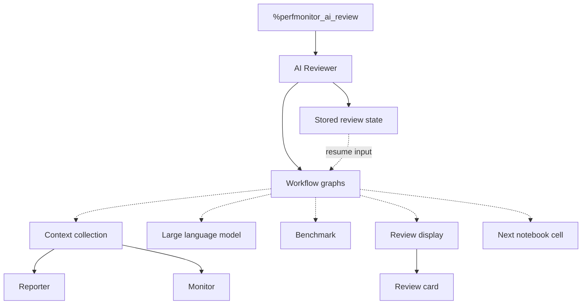
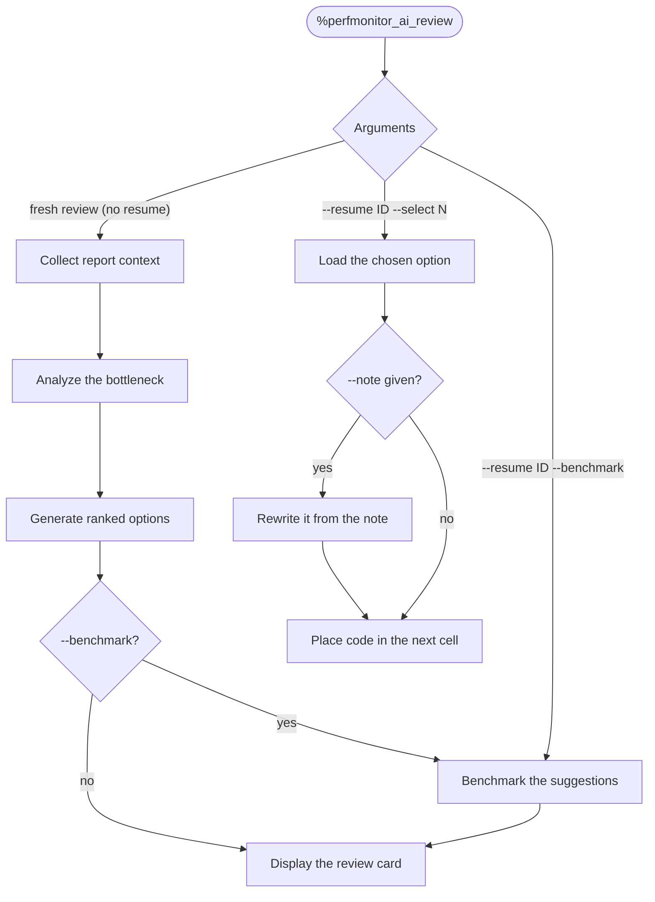
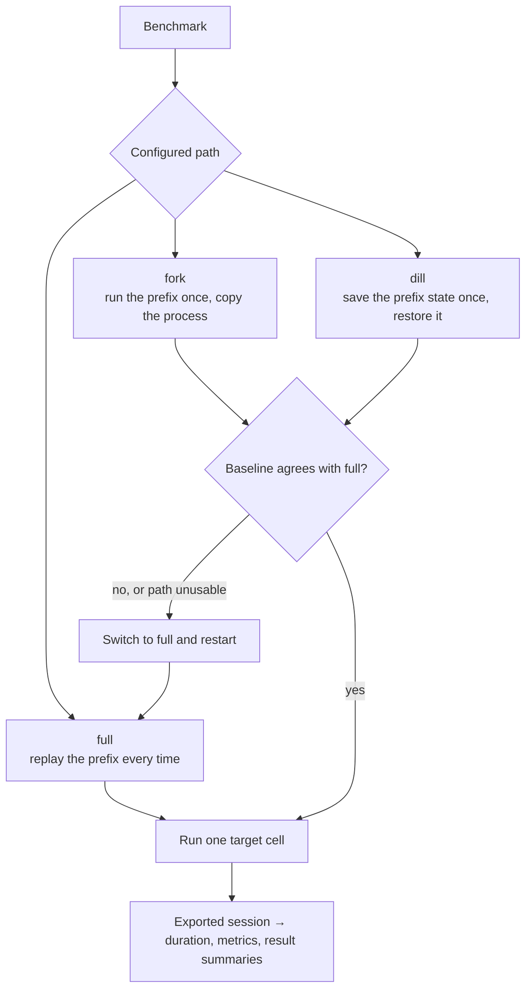
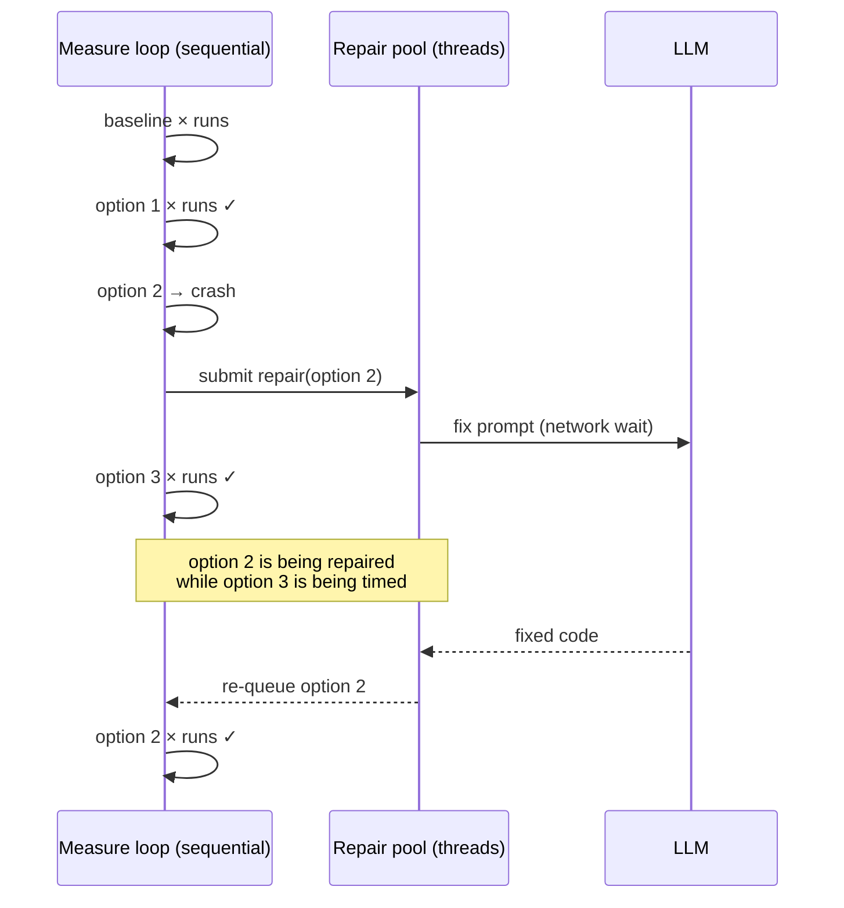
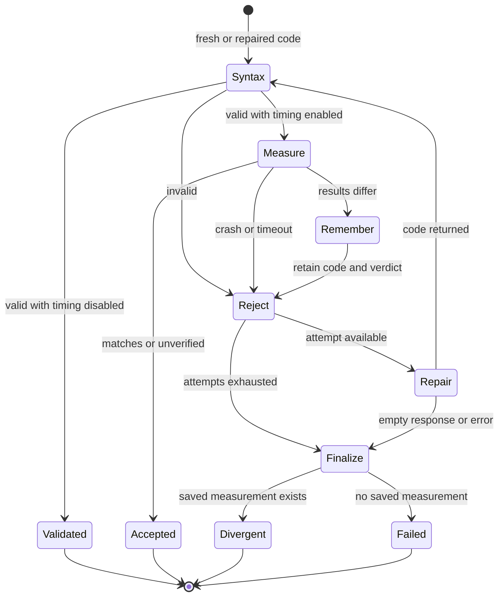

# AI Reviewer — Architecture

AI Reviewer turns recorded code and performance data into large language model
(LLM) analysis and ranked cell rewrites. It can benchmark each rewrite against
the original, repair a broken or divergent variant, and place a selected result
into the next notebook cell. It reuses Reporter and Monitor data; it does not
collect performance samples itself.

## Responsibilities

- Build review context from cell source, timings, metrics, tags, hardware, and
  installed packages.
- Compose strategy-controlled prompts for analysis, suggestions, refinement,
  and repair.
- Run fresh-review, benchmark-only, and apply workflows while retaining their
  state by run identifier (ID).
- Validate, replay, time, compare, and repair one-cell benchmark variants.
- Render text or notebook HyperText Markup Language (HTML) with code
  differences, measured verdicts, and resume commands.

## Structure

### System view

Solid arrows show ownership or a direct dependency. Dotted arrows show
collaborators used by particular paths, not one mandatory sequence. A fresh
review collects context and resolves a review strategy. Resume paths load
stored review state and enter benchmark or apply without collecting context
again.

| Part | Role in the workflow |
|---|---|
| AI Reviewer | Selects a workflow, coordinates collaborators, and retains review state by run identifier. |
| Context collection | Reads selected source code and existing performance data through Reporter and Monitor. |
| Review strategy | Selects which context sources and prompt rules the fresh review uses. |
| Workflow graphs | Coordinate fresh review, later benchmark, and apply without mixing their entry conditions. |
| Large language model (LLM) | Supplies analysis, suggestions, optional refinement, and repair code. |
| Benchmark | Validates every option and measures each version that can run. |
| Review display | Shows analysis, ranked code differences, measured verdicts, and follow-up commands. |

### LLM Context

To use smaller LLMs effectively, it's essential to clearly specify the task they need to perform. Therefore, our primary goal is to make context building system both flexible and convenient. The following schemes are aimed to give the user or the developer (choose your side) better view on how we approach LLM Context building in our project. **Source Query** - suggests an overall view at the context building in our project from the angle of request to the database. **Query Console** elaborates this idea and provides a fine-grained look at the picked sources and how they affect the resulting context.

#### Source Query

**Source Query** represents the general idea on Sources: Where **Root knowledge**: deterministic sources such as code and metrics, **Text sources**: text instructions and LLM generated analysis.

  <button class="prompt-fullscreen-toggle" type="button" aria-label="Open diagram in fullscreen" aria-pressed="false">
    <svg class="panzoom-icon" viewBox="0 0 448 512" xmlns="http://www.w3.org/2000/svg">
      <path d="M32 32C14.3 32 0 46.3 0 64l0 96c0 17.7 14.3 32 32 32s32-14.3 32-32l0-64 64 0c17.7 0 32-14.3 32-32s-14.3-32-32-32L32 32zM64 352c0-17.7-14.3-32-32-32s-32 14.3-32 32l0 96c0 17.7 14.3 32 32 32l96 0c17.7 0 32-14.3 32-32s-14.3-32-32-32l-64 0 0-64zM320 32c-17.7 0-32 14.3-32 32s14.3 32 32 32l64 0 0 64c0 17.7 14.3 32 32 32s32-14.3 32-32l0-96c0-17.7-14.3-32-32-32l-96 0zM448 352c0-17.7-14.3-32-32-32s-32 14.3-32 32l0 64-64 0c-17.7 0-32 14.3-32 32s14.3 32 32 32l96 0c17.7 0 32-14.3 32-32l0-96z"></path>
    </svg>
  </button>
  

  <input class="context-workbench__toggle" type="radio" name="context-request" id="context-request-analyze" checked>
  <input class="context-workbench__toggle" type="radio" name="context-request" id="context-request-suggest">
  <input class="context-workbench__toggle" type="radio" name="context-request" id="context-request-refine">

  

    <label for="context-request-analyze" role="tab">Analyze request</label>
    <label for="context-request-suggest" role="tab">Suggest request</label>
    <label for="context-request-refine" role="tab">Refine request</label>
    Scroll to follow the pipeline →
  

  

    

      <section class="context-stage context-stage--sources">
        <header>01<strong>Sources</strong><small>one logical catalog</small></header>
        

          <b>Root knowledge</b>
          

            Cell codeExact timingTags
            Metric summaryRaw metricsHardware
          

          <small><code>reporter.py</code> · monitor nodes · <code>collector.py</code></small>
        

        

          <b>Text sources</b>
          
<code>analyze/template.md</code>fixed role · task · layout

          
<code>analyze/spec.yaml</code><em>given</em> · <em>hints</em> · enabled defaults

        

      </section>

      
query

      <section class="context-stage context-stage--query">
        <header>02<strong>Selection plan</strong><small>resolve before reading</small></header>
        
<b>Request profile</b><code>prompt_id = analyze</code>

        
<b>Strategy</b><code>--strategy</code> or default ID<small>matching toggles override <code>enabled</code></small>

        
<b>Scope</b><code>--cells</code> · <code>--level</code><small>limits runtime records only</small>

      </section>

      
project

      <section class="context-stage context-stage--messages">
        <header>03<strong>Message projections</strong><small>two independent branches</small></header>
        

          <b>SystemMessage</b>
          template + enabled <em>given</em> + enabled <em>hints</em>
          <small>role · input descriptions · bottleneck task</small>
        

        

          <b>HumanMessage</b>
          non-empty enabled source values
          <small>code · timing · tags · metrics · hardware</small>
        

      </section>

      
assemble

      <section class="context-stage context-stage--request">
        <header>04<strong>LLM context</strong><small>Analyze request</small></header>
        

          SystemMessage
          <i>+</i>
          HumanMessage
        

      </section>
    

  

  

    

      <section class="context-stage context-stage--sources">
        <header>01<strong>Sources</strong><small>one logical catalog</small></header>
        

          <b>Root knowledge</b>
          

            Cell codeHardwareInstalled packages
          

          <small><code>reporter.py</code> · monitor · <code>default.yaml</code> package names · <code>collector.py</code> installed versions</small>
        

        

          <b>Text sources</b>
          
<b>Bottleneck analysis</b>result of the preceding Analyze request

          
<code>suggest/template.md</code>fixed role · task · layout

          
<code>suggest/spec.yaml</code><em>given</em> · <em>rules</em> · note slot

          
<code>fragments/*.md</code>referenced rule text

          
<code>--note</code>optional runtime text · hard requirement

        

      </section>

      
query

      <section class="context-stage context-stage--query">
        <header>02<strong>Selection plan</strong><small>resolve before reading</small></header>
        
<b>Request profile</b><code>prompt_id = suggest</code>

        
<b>Strategy</b><code>--strategy</code> or default ID<small>matching toggles override <code>enabled</code>; <code>require_note</code> only validates</small>

        
<b>Text input</b><code>--note</code><small>queried with Text sources; does not rewrite strategy</small>

      </section>

      
project

      <section class="context-stage context-stage--messages">
        <header>03<strong>Message projections</strong><small>two independent branches</small></header>
        

          <b>SystemMessage</b>
          template + enabled <em>given</em> + enabled <em>rules</em> + note
          <small>role · generation rules · output rules</small>
        

        

          <b>HumanMessage</b>
          non-empty enabled source values
          <small>analysis · code · hardware · package versions</small>
        

      </section>

      
assemble

      <section class="context-stage context-stage--request">
        <header>04<strong>LLM context</strong><small>Suggest request</small></header>
        

          SystemMessage
          <i>+</i>
          HumanMessage
          <i>+</i>
          Response schema
        

      </section>
    

  

  

    

      <section class="context-stage context-stage--sources">
        <header>01<strong>Sources</strong><small>stored review + resume input</small></header>
        

          <b>Root knowledge</b>
          

            Selected option full code
            Other options' diffs
          

        

        

          <b>Text sources</b>
          
<b>Bottleneck analysis</b>stored result of the preceding Analyze request

          
<code>refine/template.md</code>fixed role · adjustment task · output contract

          
<code>refine/spec.yaml</code>enabled style rules

          
<code>fragments/*.md</code>referenced Python or R style text

          
<code>--note</code>required custom instruction

        

      </section>

      
query

      <section class="context-stage context-stage--query">
        <header>02<strong>Selection plan</strong><small>resume one stored review</small></header>
        
<b>Request profile</b><code>prompt_id = refine</code>

        
<b>Stored review</b><code>--resume RUN_ID</code><small>loads analysis, options, target code, and the original strategy toggles</small>

        
<b>Option</b><code>--select N</code><small>selects a title and full code; every other option becomes a diff against its own original target cell</small>

        
<b>Text input</b><code>--note</code><small>without it, resume applies directly and no Refine request is sent</small>

      </section>

      
project

      <section class="context-stage context-stage--messages">
        <header>03<strong>Message projections</strong><small>two independent branches</small></header>
        

          <b>SystemMessage</b>
          template + enabled style rules
          <small>role · adjustment task · use-of-diffs constraint · code-only output</small>
        

        

          <b>HumanMessage</b>
          stored values + derived diffs + new instruction
          <small>analysis · other-option diffs · selected full code · <code>--note</code></small>
        

      </section>

      
assemble

      <section class="context-stage context-stage--request">
        <header>04<strong>LLM context</strong><small>Refine request</small></header>
        

          SystemMessage
          <i>+</i>
          HumanMessage
        

      </section>
    

  

!!! note "Messages are projections"

    HumanMessage and SystemMessage are not records in the source catalog but conventional logical parts of the prompt, coming from **LangChain** library.

##### Precedence

1. The graph step selects the Analyze, Suggest, or Refine profile.
2. `--strategy` selects a `strategies.yaml` entry; `default.yaml` supplies the
   ID only when the option is omitted.
3. The selected strategy's merged toggles override matching source and prompt
   item defaults.
4. Suggest consumes the bottleneck analysis from the preceding Analyze call,
   together with code, hardware, and installed package versions.
5. Scope options select fresh-review records. For Refine, `--resume` reloads the
   stored review and its strategy toggles; `--select` chooses one option.
   `--note` is the Human-message instruction that makes the Refine call run.

#### Query Interactive Console

Choose the request, strategy, and whether `--note` is present. The selected
sources, query plan, and returned `SystemMessage` and `HumanMessage` update
together.

  <button class="prompt-fullscreen-toggle" type="button" aria-label="Open diagram in fullscreen" aria-pressed="false">
    <svg class="panzoom-icon" viewBox="0 0 448 512" xmlns="http://www.w3.org/2000/svg">
      <path d="M32 32C14.3 32 0 46.3 0 64l0 96c0 17.7 14.3 32 32 32s32-14.3 32-32l0-64 64 0c17.7 0 32-14.3 32-32s-14.3-32-32-32L32 32zM64 352c0-17.7-14.3-32-32-32s-32 14.3-32 32l0 96c0 17.7 14.3 32 32 32l96 0c17.7 0 32-14.3 32-32s-14.3-32-32-32l-64 0 0-64zM320 32c-17.7 0-32 14.3-32 32s14.3 32 32 32l64 0 0 64c0 17.7 14.3 32 32 32s32-14.3 32-32l0-96c0-17.7-14.3-32-32-32l-96 0zM448 352c0-17.7-14.3-32-32-32s-32 14.3-32 32l0 64-64 0c-17.7 0-32 14.3-32 32s14.3 32 32 32l96 0c17.7 0 32-14.3 32-32l0-96z"></path>
    </svg>
  </button>
  <iframe
    id="query-console-material"
    src="../prompt-assembly/query-console-material-embed.html"
    title="Prompt assembly query console — Material style"
    loading="lazy">
  </iframe>

##### What the panels show

| Panel | Content |
|---|---|
| Sources | Root knowledge and Text-source rows, including whether this request selects each row |
| Query | Scope, selected identifiers, strategy overrides, and values that are never queried |
| Returned context | The rendered `SystemMessage` and the runtime values placed in `HumanMessage` |

Suggest receives the bottleneck analysis produced by Analyze. Refine reloads
that analysis and the stored options. `--select` supplies the selected title
and full code; every other option is converted to a diff against its own
original target cell; `--note` becomes the custom instruction. Refine inherits
the original review's strategy toggles.

### Workflows

- A fresh review collects recorded cell code and performance data, requests an
  analysis and ranked options, and optionally benchmarks them before display.
- A later benchmark reuses stored suggestions without repeating context
  collection, analysis, or suggestion calls.
- Apply loads one stored option, optionally refines it from a user note, and
  places the result in the next cell without running it.

### Benchmark

Benchmarking turns a proposal into a measured verdict. For a one-cell review,
it:

1. Measures the original cell as the baseline.
2. Validates every option and measures each version that can run.
3. Compares each result with the baseline and reports timing together with
   whether the result still matches.

Multi-cell reviews remain reviewable, but their benchmark step is skipped
because each target needs its own baseline and notebook state.

#### Replay paths

A replay runs the target cell in a separate operating-system process.

!!! note "State reconstruction"
    Before the target runs, the replay reconstructs the prefix: all recorded
    cells before the target. The replay path decides how often this work is
    repeated. The separate process isolates measurements from each other, not
    from the machine. Replayed code can still overwrite real files or repeat
    real network actions, such as submitting the same job twice.

| Path | Language | Trade-off |
|---|---|---|
| `full` | Every supported language | The reference result; repeats all prefix work. |
| `fork` | Python | Reduces repeated setup, but copied memory can inflate memory figures and library worker threads may not survive the copy. |
| `dill` | Python | No process-copy effects; only safely saveable state survives, and the checkpoint can cost more than it saves. |

`fork` and `dill` accelerate Python benchmarks. By default, their baseline
result is checked once against `full`. If a path is unavailable, unsafe for the
recorded state, or produces a different baseline, the benchmark falls back to
`full`. Measurements already taken through the old path are discarded so one
verdict never mixes replay paths.

#### Measurement and repair concurrency

The LLM repairs option 2 while the measure loop times option 3, reducing total
benchmark time without distorting measurements. Measurements remain sequential
so options do not compete for processor, memory, or graphics-card resources.
Returned code re-enters the same queue and passes the checks again.

#### Repair loop

Syntax failures, crashes, timeouts, and changed results share one repair
budget. A repaired version is checked from the beginning. If repair is
exhausted, the final state depends on whether any version completed a
measurement. When timing is disabled with **`--skip-check run`**, valid syntax
settles as validated and invalid code follows the same repair path.

- **`Divergent`** — At least one version ran, but its result differed from the
  baseline. The benchmark keeps that real measurement and marks its speedup as
  unearned.
- **`Failed`** — No version completed a measurement before repair stopped
  because attempts were exhausted or the LLM returned no usable code. There is
  no timing verdict to report.

## Design patterns

| Class | Pattern | Implementation role |
|---|---|---|
| `AIReviewer` | **Facade** | Coordinates context collection, compiled graphs, benchmarking, display, and pending review state behind the service-facing review operations. |
| `AIReviewerProtocol` | **Structural Subtyping** | Defines the service contract shared by the available and unavailable reviewer implementations. |
| `UnavailableAIReviewer` | **Null Object** | Keeps the service dependency valid when the optional AI packages are absent and reports how to enable them. |
| `LanguageAdapter` | **Strategy** | Supplies language-specific syntax validation, output-name extraction, and replay rendering. |
| `ReplayStrategy` | **Strategy** | Selects how benchmark prefix state is reconstructed without changing result reading or scoring. |

| Method | Pattern | Implementation role |
|---|---|---|
| `AIReviewer.attach()` | **Dependency Injection** | Binds the live or imported monitor after reviewer construction. |
| `BenchmarkOrchestrator._drive()` | **Work Queue** | Serializes candidate processing while tracking concurrent repair futures and re-queuing returned code. |

| Function | Pattern | Implementation role |
|---|---|---|
| `build_ai_reviewer()` | **Factory** | Selects the real reviewer or its unavailable implementation according to installed dependencies. |
| `register_adapter()` | **Registry** | Maps a recorded cell language to its benchmark adapter. |
| `register_strategy()` | **Registry** | Maps a configured replay mode to its replay strategy. |

## Key files

| File | Role |
|---|---|
| `adapters/ai_reviewer/reviewer.py` | Exposes the adapter facade, stores pending reviews, and assembles benchmark dependencies |
| `adapters/ai_reviewer/agent/graph.py` | Defines the fresh-review, benchmark-only, and apply LangGraph workflows |
| `adapters/ai_reviewer/agent/nodes.py` | Implements prompt calls, benchmark integration, display, refinement, and apply nodes |
| `adapters/ai_reviewer/context/collector.py` | Builds strategy-controlled review context from Reporter and Monitor data |
| `adapters/ai_reviewer/strategy/strategies.yaml` | Declares named prompt and context strategies |
| `adapters/ai_reviewer/benchmark/orchestrator.py` | Owns sequential measurement, verdicts, retries, and the shared repair queue |
| `adapters/ai_reviewer/benchmark/runner.py` | Runs replay strategies and reads exported sessions through the normal reporting path |
| `adapters/ai_reviewer/benchmark/replay/base.py` | Defines the interchangeable prefix-state replay contract |
| `adapters/ai_reviewer/language/base.py` | Defines the per-language benchmark contract and capabilities |
| `adapters/ai_reviewer/ui/review_display.py` | Renders text and HTML diffs, verdicts, and resume commands |

## Notes

- Review state lives in the running Python process and is lost when it restarts.
- Benchmarking accepts one reviewed cell at a time.
- A replay is not the live notebook: interaction with the notebook user
  interface may not be reproducible under any replay path.
