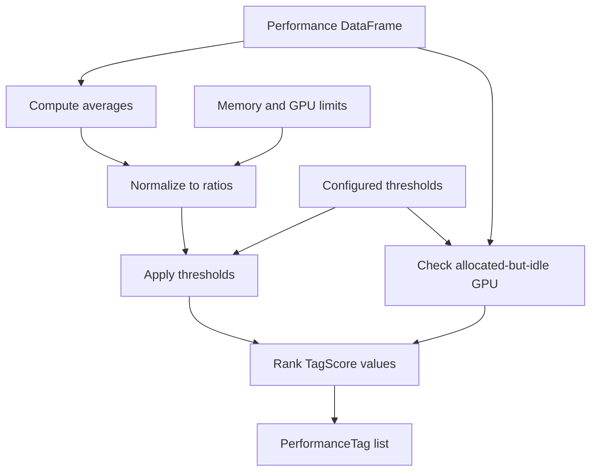

# Analyzer — Architecture

The analyzer converts collected metrics into ranked workload labels. It
compares average central processing unit (CPU), memory, and graphics processing
unit (GPU) use with resource limits and configured thresholds. It classifies
data but does not collect samples or render reports.

## Responsibilities

- Compute averages for the metric columns that are present.
- Normalize measurements to utilization ratios between `0.0` and `1.0`.
- Apply per-resource thresholds and rank matching labels by utilization.
- Detect a GPU that holds memory but remains idle for much of the sample window.

## Structure

## Design patterns

| Class | Pattern | Implementation role |
|---|---|---|
| `PerformanceTag`, `TagScore` | **Value Object** | Represents each classification as a typed tag and comparable score. |

| Method | Pattern | Implementation role |
|---|---|---|
| `PerformanceAnalyzer.analyze_cell_performance()` | **Processing Pipeline** | Runs metric extraction, normalization, thresholding, GPU-idle detection, and ranking in a fixed sequence. |
| `PerformanceAnalyzer.__init__()` | **Dependency Injection** | Accepts threshold overrides without coupling the classification algorithm to configuration loading. |

| Enum member | Pattern | Implementation role |
|---|---|---|
| `PerformanceTag.NORMAL` | **Special Case** | Represents a valid no-bottleneck result instead of returning an empty collection. |

## Key files

| File | Role |
|---|---|
| `adapters/analyzer.py` | Defines labels, scores, thresholds, and the classification pipeline |
| `adapters/reporter.py` | Supplies filtered samples and resource limits to the analyzer |

## Notes

- Missing metric columns contribute no classification signal.
- Ratios are clamped to the inclusive range `0.0`–`1.0`.
- The allocated-but-idle GPU label is placed before resource-bound labels.
- When no threshold matches, the result is `NORMAL` with score `0.0`.
