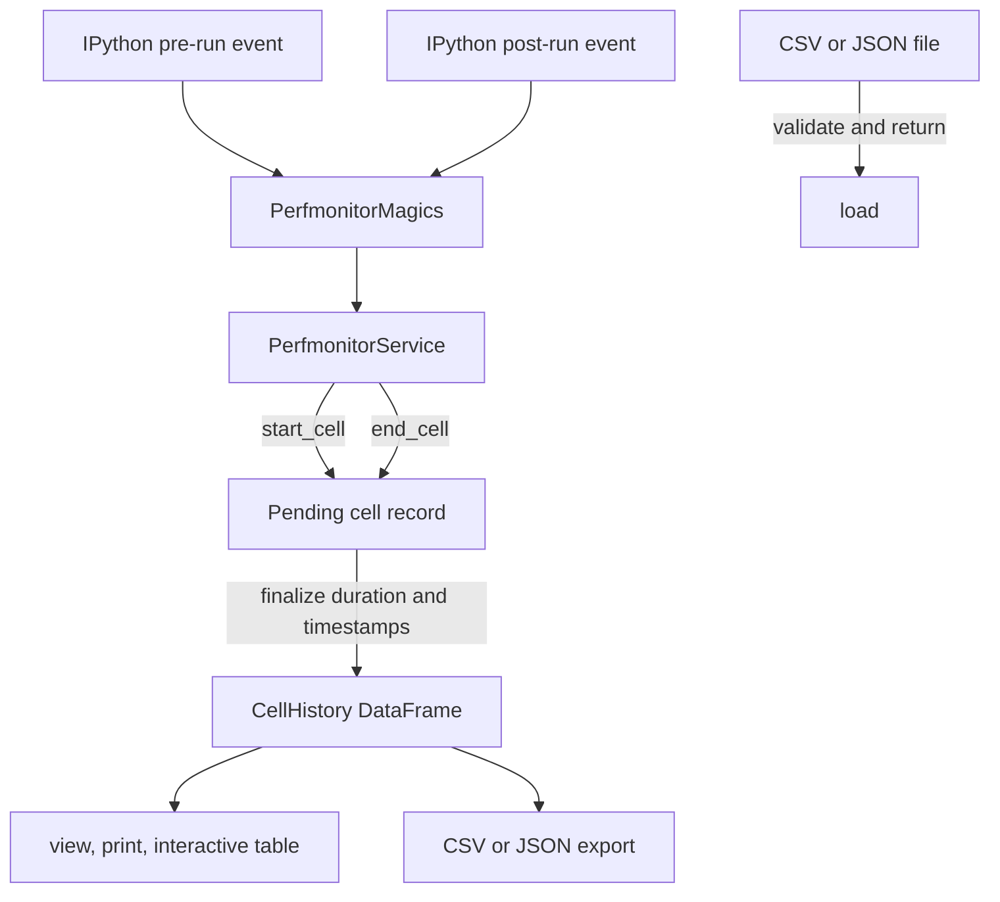

# Cell History — Architecture

Cell History records one row per completed notebook cell. Each row keeps source
code, detected IPython magic commands, language, elapsed-time measurements, and
wall-clock timestamps. The adapter records execution metadata; it does not run
cells or collect resource samples.

## Responsibilities

- Open a pending record before a cell runs and finalize it afterward.
- Keep completed records in one pandas `DataFrame` table.
- Provide sliced, printed, and interactive-table views.
- Export and validate comma-separated values (CSV) and JavaScript Object
  Notation (JSON) files.

## Structure

## Design patterns

| Class | Pattern | Implementation role |
|---|---|---|
| `CellHistory` | **Repository** | Owns history storage, indexed views, presentation, and persistence behind one interface. |

| Method | Pattern | Implementation role |
|---|---|---|
| `PerfmonitorMagics.pre_run_cell()`, `PerfmonitorMagics.post_run_cell()` | **Observer** | Forward IPython lifecycle events without coupling `CellHistory` to the notebook runtime. |
| `CellHistory.start_cell()`, `CellHistory.end_cell()` | **Event Log** | Stage one execution and append its completed record to the ordered history. |

## Key files

| File | Role |
|---|---|
| `adapters/cell_history.py` | Owns the pending record, completed table, views, and persistence |
| `ipython/magics.py` | Receives IPython's before-cell and after-cell events |
| `core/service.py` | Forwards lifecycle events to `CellHistory` |

## Notes

- Only one pending cell is supported; starting another replaces it.
- Only completed cells enter `data`; the execution result is not stored.
- `load()` validates and returns a table but does not replace live history.
- `cell_magics` and `language` are optional during file validation so older
  exports remain readable.
