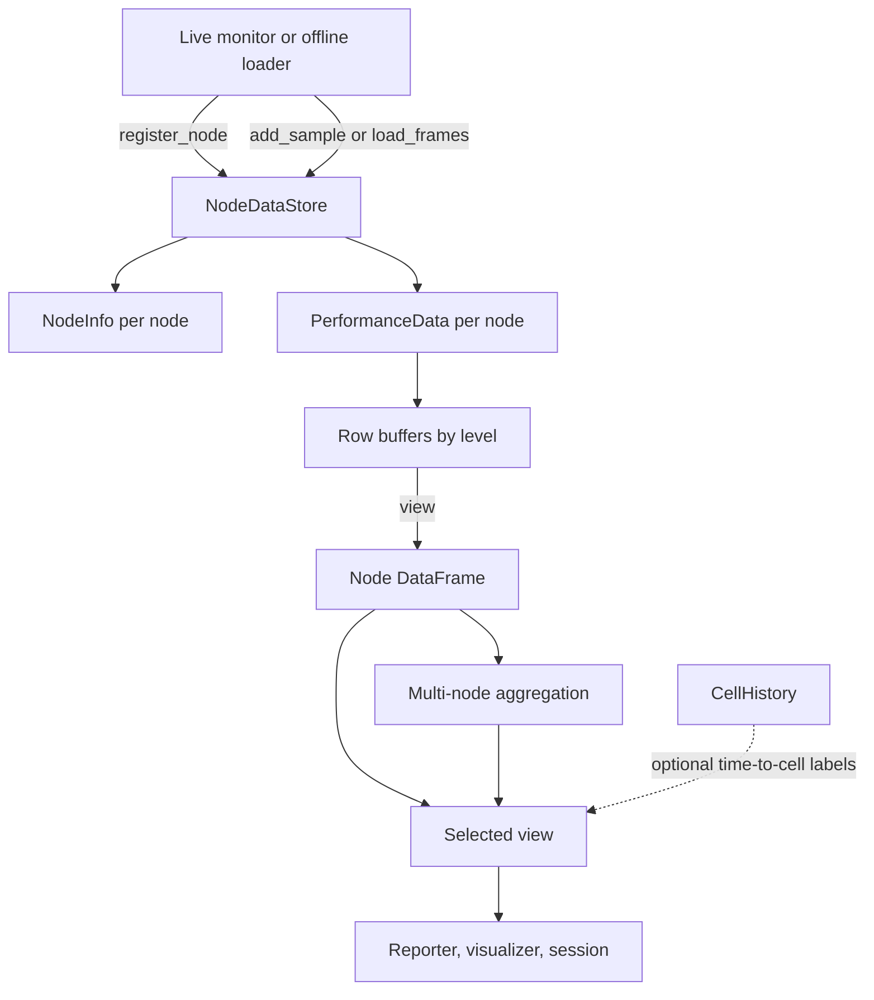

# Data — Architecture

The data adapter is the in-memory boundary between metric collectors and the
features that consume their output. It stores hardware metadata and time-series
samples per node and monitoring level, then exposes pandas `DataFrame` tables
(two-dimensional labeled data). Collection, analysis, and plotting stay in
other components.

## Responsibilities

- Keep each node's `NodeInfo` metadata and `PerformanceData` samples together.
- Append samples to lightweight per-level row buffers.
- Return single-node or aggregated views, optionally labeled by cell index.
- Export views to comma-separated values (CSV) or JavaScript Object Notation
  (JSON), and load both formats for offline use.

## Structure

## Design patterns

| Class | Pattern | Implementation role |
|---|---|---|
| `NodeDataStore` | **Repository** | Owns per-node registration, writes, aggregate queries, and persistence through one interface. |
| `NodeInfo` | **Data Transfer Object** | Carries node hardware metadata across monitors, reporters, and session serialization. |

| Method | Pattern | Implementation role |
|---|---|---|
| `PerformanceData.export()`, `PerformanceData.load()` | **Strategy** | Dispatch file conversion through format-to-callable tables selected by extension. |
| `PerformanceData.add_sample()`, `PerformanceData.view()` | **Lazy Materialization** | Append raw sample dictionaries and construct a pandas table only on read. |

## Key files

| File | Role |
|---|---|
| `adapters/data/data.py` | Stores per-level samples and handles table import and export |
| `adapters/data/node.py` | Owns per-node data, hardware metadata, and aggregation rules |
| `adapters/data/__init__.py` | Exposes the adapter's public internal types |

## Notes

- Registering an existing node replaces its stored samples.
- A sample for an unknown node is ignored.
- Multi-node views align rows by position and stop at the shortest node series.
  Memory and input/output counters are summed; processor and graphics metrics
  use mean, minimum, or maximum aggregation as appropriate.
- Cell labels use inclusive cell start and end times.
