# Adapters

An **adapter** is a feature component that keeps infrastructure details out of
`PerfmonitorService`. Adapters store samples, record cells, analyze metrics,
render output, and move sessions between memory and disk.

Each adapter has two pages:

- **Architecture** — a card you can skim: what the adapter does, how its parts
  connect, and which design patterns it uses.
- **API Reference** — signatures and docstrings generated directly from the
  Python code by `mkdocstrings`.

## Map

| Adapter | Responsibility |
|---|---|
| [Data](data/architecture.md) | Stores performance samples per node and serves them as pandas tables |
| [Cell History](cell-history/architecture.md) | Records executed notebook cells with timings and source |
| [Analyzer](analyzer/architecture.md) | Classifies a cell by processor, memory, or graphics use |
| [Reporter](reporter/architecture.md) | Renders text and notebook performance reports |
| [Visualizer](visualizer/architecture.md) | Plots metrics via matplotlib or Plotly |
| [Session](session/architecture.md) | Exports and imports a whole session (data + history + manifest) |
| [Script Writer](script-writer/architecture.md) | Turns recorded cells into a runnable Python script |
| [AI Reviewer](ai-reviewer/architecture.md) | Reviews cells using a large language model (LLM) |

## Dependencies

`PerfmonitorService` is the single entry point. Gray boxes group collaborators
by workflow; repeated components show which workflows use the same dependency.
Arrows point from a component to a collaborator it uses.

  
  

    
      
      User-facing adapters
    
    
      
      Runtime / low-level adapters
    
  

[Mermaid source](assets/overview-dependencies.mmd)

Yellow marks the core service. Blue nodes implement user-facing features;
green nodes provide monitoring, storage, or analysis.

## Design patterns

This index lists recurring patterns by implementation type. Adapter
architecture pages contain the local applications.

| Class | Pattern | Implementation role |
|---|---|---|
| `MonitorProtocol`, `VisualizerProtocol`, `ReportDisplayerProtocol` | **Structural Subtyping** | Define collaboration contracts independently of concrete implementations. |
| `UnavailablePerformanceMonitor`, `UnavailableVisualizer`, `UnavailableReportDisplayer` | **Null Object** | Keep service dependencies valid when an optional capability is unavailable. |

| Method | Pattern | Implementation role |
|---|---|---|
| `PerformanceReporter.attach()`, `PerformanceVisualizer.attach()` | **Dependency Injection** | Bind runtime monitors without constructing them inside feature adapters. |
| `PerformanceVisualizer.plot()` | **Template Method** | Own the shared plotting workflow and delegate backend-specific rendering to hooks. |

| Function | Pattern | Implementation role |
|---|---|---|
| `build_performance_reporter()`, `build_performance_visualizer()` | **Factory** | Centralize concrete implementation selection and dependency assembly. |
| `register()` | **Registry** | Registers renderer functions by configured plot-type name. |

| Module variable | Pattern | Implementation role |
|---|---|---|
| `RENDERERS` | **Registry** | Stores the renderer lookup used by backend-independent plotting code. |
