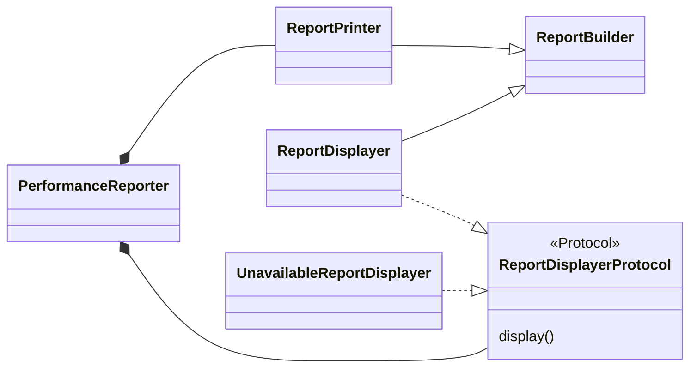
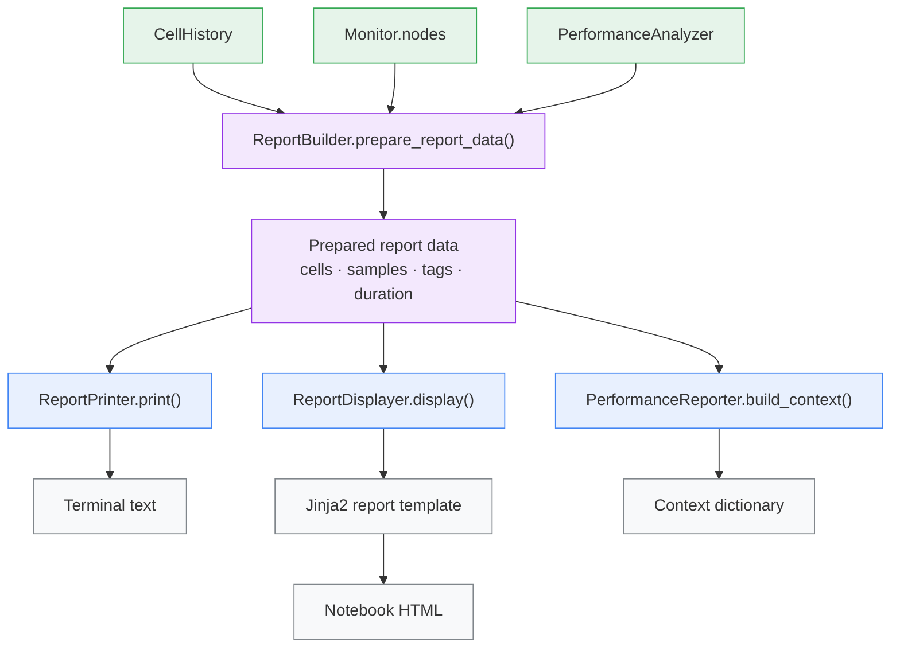

# Reporter — Architecture

Reporter turns cell history and metric samples into a compact performance
summary. It prepares one shared report model, classifies it with Analyzer, and
renders plain text or HyperText Markup Language (HTML) for notebook display. It
does not collect samples.

## Responsibilities

- Select a cell range and its matching performance samples.
- Compute duration, hardware limits, and ranked performance labels.
- Render the same information as terminal text or notebook HTML.
- Build a cell-labeled context for internal consumers.
- Degrade cleanly when rich notebook display is unavailable.

## Structure

### Class relationships

`build_performance_reporter()` constructs the facade and its two output
collaborators. `ReportPrinter` and `ReportDisplayer` receive the same
`PerformanceAnalyzer` instance.

### Report data flow

The unavailable displayer follows the same `ReportDisplayerProtocol` contract,
but reports why rich output is disabled instead of entering the data pipeline.

## Design patterns

| Class | Pattern | Implementation role |
|---|---|---|
| `PerformanceReporter` | **Facade** | Exposes text, HTML, and AI-context operations over the reporting subsystem. |
| `UnavailableReportDisplayer` | **Null Object** | Preserves the display contract when rich notebook output is disabled. |
| `ReportDisplayerProtocol` | **Structural Subtyping** | Defines the display contract implemented by both real and unavailable displayers. |

| Method | Pattern | Implementation role |
|---|---|---|
| `ReportBuilder.prepare_report_data()` | **Processing Pipeline** | Applies range resolution, sample filtering, classification, and summary calculation in a fixed order. |
| `PerformanceReporter.attach()` | **Dependency Injection** | Rebinds the printer and displayer to a live or imported monitor after construction. |

| Function | Pattern | Implementation role |
|---|---|---|
| `build_performance_reporter()` | **Factory** | Constructs a reporter with one shared analyzer and the selected display implementation. |

## Key files

| File | Role |
|---|---|
| `adapters/reporter.py` | Prepares report data and coordinates text and HTML output |
| `adapters/analyzer.py` | Produces ranked performance labels |
| `templates/report/report.html` | Defines notebook report markup |
| `templates/report/styles.css` | Defines notebook report presentation |

## Notes

- With no explicit range, a report uses the last cell whose duration is at least
  one monitor interval.
- `build_context()` removes idle gaps and labels samples with their cell index.
- The printer and HTML displayer share one analyzer instance.
- Despite its name, `ReportBuilder` is a shared data-preparation base class, not
  an implementation of the **Builder** design pattern.
