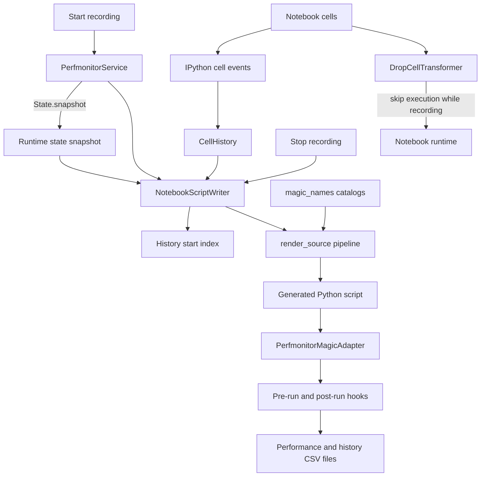

# Script Writer — Architecture

Script Writer turns recorded notebook cells into a Python script that a plain
interpreter can run when JUmPER is installed. It restores monitoring settings,
wraps every cell in JUmPER lifecycle calls, and translates IPython magic syntax
(commands prefixed with `%` or `%%`). It cannot reproduce every notebook-only
feature.

## Responsibilities

- Snapshot runtime state and remember where recording starts in cell history.
- Select recorded cells while excluding the start and stop control commands.
- Rewrite supported JUmPER magics and remove notebook-only line syntax.
- Keep Python bodies of transparent cell magics and flag non-Python bodies.
- Generate a script harness that monitors cells and exports result tables.

## Structure

## Design patterns

| Class | Pattern | Implementation role |
|---|---|---|
| `PerfmonitorMagicAdapter` | **Adapter** | Exposes notebook magic behavior as regular Python calls that generated scripts can execute. |

| Method | Pattern | Implementation role |
|---|---|---|
| `NotebookScriptWriter.start_recording()`, `NotebookScriptWriter.stop_recording()` | **Facade** | Provide a two-operation boundary over cell selection, transformation, and file generation. |
| `State.snapshot()` | **Memento** | Captures independent monitoring and reporting state for restoration in the generated script. |

| Function | Pattern | Implementation role |
|---|---|---|
| `render_source()` | **Processing Pipeline** | Applies cell-magic removal, command rewriting, parse validation, and diagnostics in sequence. |

## Key files

| File | Role |
|---|---|
| `adapters/script_writer.py` | Owns recording state, source transformation, and script generation |
| `adapters/magic_names.py` | Lists supported, transparent, and unsupported magic commands |
| `core/state.py` | Provides the independent runtime-state snapshot |
| `ipython/extension.py` | Prevents recorded cells from also running in the notebook |
| `core/service.py` | Starts and stops recording and builds the generated script's adapter |

## Notes

- Non-control cells are recorded but skipped in the notebook while recording is active.
- JUmPER line magics become adapter calls; foreign line magics and shell syntax
  are dropped with comments where possible.
- User Python syntax errors are preserved so the generated run reports the real error.
- The generated script disables plots and rich reports, then exports performance
  data and cell history as comma-separated values (CSV) files.
