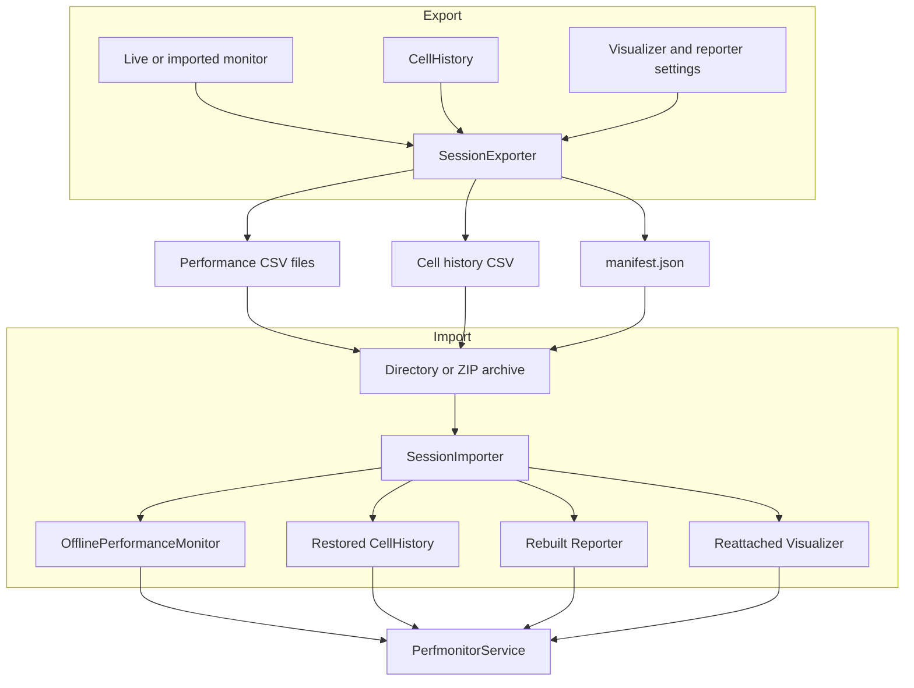

# Session — Architecture

A session archive is a portable snapshot of collected metrics, cell history,
hardware metadata, and selected display settings. The adapter writes that
snapshot as a directory or compressed ZIP archive and restores it through an
offline monitor. It does not resume metric collection.

## Responsibilities

- Export each available monitoring level and the cell history as
  comma-separated values (CSV) files.
- Write a JavaScript Object Notation (JSON) manifest describing schemas,
  hardware, timing, and selected settings.
- Package or unpack the files when the target is a ZIP archive.
- Replace the service monitor with static imported data.
- Reattach the visualizer and rebuild the reporter for offline exploration.

## Structure

## Design patterns

| Class | Pattern | Implementation role |
|---|---|---|
| `OfflinePerformanceMonitor` | **Adapter** | Exposes imported tables through the same monitor contract used for live samples. |

| Method | Pattern | Implementation role |
|---|---|---|
| `SessionExporter._build_manifest()` | **Memento** | Captures monitor, schema, visualization, and reporting state required for offline restoration. |
| `SessionExporter.export()`, `SessionImporter.import_()` | **Facade** | Provide one operation over each multi-file export and import workflow. |
| `SessionExporter.__init__()`, `SessionImporter.import_()` | **Dependency Injection** | Receive active service collaborators instead of constructing runtime components internally. |

## Key files

| File | Role |
|---|---|
| `adapters/session.py` | Implements archive export, import, and service rewiring |
| `monitor/common.py` | Defines the offline monitor used for imported sessions |
| `adapters/data/node.py` | Supplies aggregated metric and hardware views |

## Notes

- Performance files contain the aggregate node view, not separate files per node.
- Import replaces the current cell table and monitor; it does not merge sessions.
- An imported monitor is static: `running` remains `False` and live plotting is
  unavailable.
- The importer expects `manifest.json`; it currently reads the recorded version
  but does not validate it.
