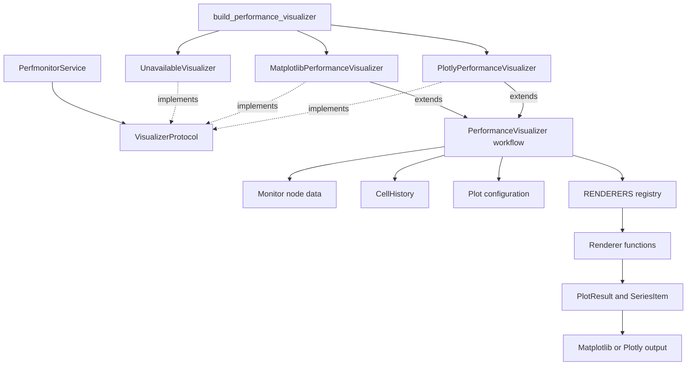

# Visualizer — Architecture

Visualizer converts collected samples into configurable metric plots. A shared
workflow filters data and prepares the time axis; Matplotlib and Plotly backends
(drawing engines) produce static or interactive output. The adapter does not
collect samples.

## Responsibilities

- Resolve configured metric groups for processor, memory, graphics, and
  input/output data.
- Select cells, remove idle gaps when requested, and prepare each monitoring level.
- Render direct plots, interactive dashboards, exported figures, or live updates.
- Share backend-independent series preparation across both drawing engines.
- Fall back to an unavailable implementation when plotting is disabled.

## Structure

## Design patterns

| Class | Pattern | Implementation role |
|---|---|---|
| `MatplotlibPerformanceVisualizer`, `PlotlyPerformanceVisualizer` | **Strategy** | Provide interchangeable drawing backends behind the visualizer contract. |
| `UnavailableVisualizer` | **Null Object** | Preserves the visualizer contract when plotting is unavailable. |
| `VisualizerProtocol` | **Structural Subtyping** | Defines the minimal contract consumed by `PerfmonitorService`. |

| Method | Pattern | Implementation role |
|---|---|---|
| `PerformanceVisualizer.plot()`, `PerformanceVisualizer._render_direct_plot()` | **Template Method** | Keep selection and preparation in the base workflow while subclasses implement rendering hooks. |

| Function | Pattern | Implementation role |
|---|---|---|
| `build_performance_visualizer()` | **Factory** | Selects a concrete backend or the disabled implementation at one construction point. |
| `register()` | **Registry** | Registers renderer functions by configured plot-type name. |

| Module variable | Pattern | Implementation role |
|---|---|---|
| `RENDERERS` | **Registry** | Stores the renderer lookup consumed by backend-independent plotting code. |

## Key files

| File | Role |
|---|---|
| `adapters/visualizer/visualizer.py` | Owns the shared workflow, protocol, factory, and live plotting |
| `adapters/visualizer/backends/matplotlib.py` | Draws Matplotlib figures and widgets |
| `adapters/visualizer/backends/plotly.py` | Draws Plotly figures and browser-based controls |
| `adapters/visualizer/render.py` | Defines renderer registration and backend-neutral plot models |
| `adapters/visualizer/renderers.py` | Implements built-in series renderers |
| `config/plots/default.yaml` | Declares default metric groups and plot types |

## Notes

- `attach()` must run before plotting; it loads plot configuration and hardware
  limits from the selected monitor.
- Supplying a monitoring level uses the direct path without interactive widgets.
- Without a cell range, plotting starts at the last cell longer than one monitor
  interval and continues through the newest cell.
- Live plots update on a background thread and stop when monitoring stops.
